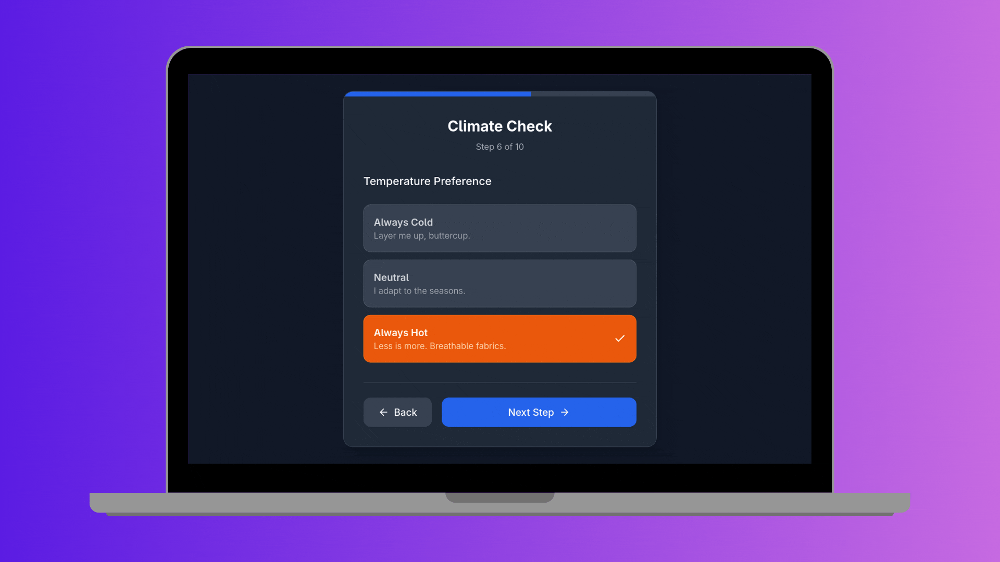

# VibeStylist

> [!NOTE]
> 🚧 **Work in Progress**: This project is currently under active development. Features and UI are subject to change.


## 🌟 Overview

VibeStylist is your personal AI fashion assistant, designed to help you curate your wardrobe, plan outfits, and discover your unique style.

### 🔗 Live Links
- **Live Preview:** [vibestylist.netlify.com](https://vibestylist.netlify.com)
- **Developer Portfolio:** [syreese.com](https://syreese.com)

## ✨ Features

### Current Features
- **AI Stylist Chat**: Chat with an AI to get outfit recommendations and style advice.
- **Wardrobe Management**: Add and organize your clothes digitally.
- **Outfit Planning**: Create and save outfit combinations.
- **Wishlist**: Save items you want to buy.
- **Style Interview**: A personality quiz to help the AI understand your style.

### 🚀 Future Features
- **Social Sharing**: Share your outfits with friends.
- **Calendar Integration**: Plan outfits for specific dates.
- **Virtual Try-On**: See how clothes look on you before buying (Experimental).
- **Advanced Analytics**: Deeper insights into your wearing habits.

## 🐛 Known Bugs

We are aware of the following issues and are working to resolve them:
- **API Key Issue**: Users can input their API key, but the chat functionality may not work as expected due to connection issues.
- **Firefox Interview Loop**: The style interview may restart unexpectedly on Firefox browsers.

## 🛠️ Installation & Usage

1. **Clone the repository**
   ```bash
   git clone https://github.com/SyreeseOfficial/VibeStylist.git
   cd VibeStylist
   ```

2. **Install dependencies**
   ```bash
   npm install
   ```

3. **Start the development server**
   ```bash
   npm run dev
   ```

## 🤝 Contributing

Contributions are welcome! Please feel free to submit a Pull Request.
